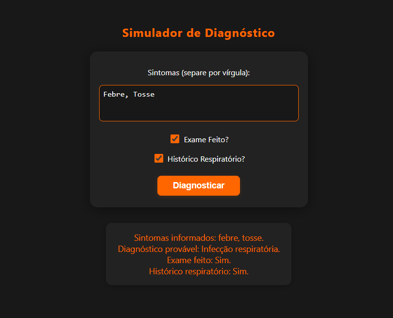

# Diagnóstico Médico Inteligente

Um sistema web interativo para simulação de diagnósticos médicos baseado em sintomas informados pelo usuário. O objetivo é auxiliar estudantes e profissionais a compreenderem a lógica de triagem clínica, utilizando conceitos de programação e integração entre frontend e backend.

---

## 💡 Valor do Projeto

Este projeto resolve o problema de triagem inicial de sintomas, permitindo que qualquer pessoa insira sintomas e obtenha uma sugestão automatizada de diagnóstico. Ele se encaixa na disciplina de Pensamento Computacional ao abordar:

- **Fundamentos do Pensamento Computacional:** aplicação prática de lógica e algoritmos para análise de sintomas.
- **Máquinas Computacionais:** uso de APIs e sistemas web para simular o raciocínio clínico.
- **Aplicações Práticas:** integração entre frontend e backend, mostrando como o pensamento computacional é utilizado em soluções reais.
- **Resolução de Problemas e Modelagem:** modelagem de regras de diagnóstico e automação da triagem.
- **Tratamento de Erros:** validação de dados e respostas apropriadas para diferentes cenários.
- **Limitações:** demonstração dos limites de diagnósticos automatizados e a importância do acompanhamento profissional.

Assim, o sistema exemplifica como o Pensamento Computacional pode ser aplicado em todas as etapas do desenvolvimento de soluções tecnológicas para problemas do cotidiano.

---

## 🛠️ Ferramentas Utilizadas

- **C#** (ASP.NET Core) — Backend da API
- **HTML5** e **CSS3** — Interface web moderna e responsiva
- **JavaScript** — Comunicação frontend-backend
- **Swagger** — Documentação e testes da API
- **Visual Studio Code** — Ambiente de desenvolvimento
- **.NET 6/7** — Plataforma de execução

---

## 👥 Equipe

Turma de Ciência da Computação - UDF

- @RaphaelLins6 - **Raphael Lins** (RGM: 27797660)
- @jotape99 - **João Pedro** (RGM: 28167333)
- @joaogkt - **João Gabriel** (RGM: 28017188)

---

## 🚀 Contribuição de Cada Membro

- **Raphael Lins:** Estruturação da API, criação dos controllers, endpoints REST e lógica de manipulação de tarefas, elaboração do README e documentação do projeto
- **João Pedro:** Implementação da interface Kanban, estilização com CSS, lógica de interação no JavaScript.
- **João Gabriel:** Testes de usabilidade, revisão do código.

---

## 🎬 Demonstração

### Tela Inicial

### Diagnóstico Gerado

> Vídeo da aplicação!

https://github.com/user-attachments/assets/72910f31-595b-456e-8aaf-e3db326df0e9

---

## 📄 Licença

Este projeto está licenciado sob a GNU General Public License v3.0 (GPLv3).  
Sinta-se livre para usar, modificar e compartilhar!

---

> Projeto acadêmico desenvolvido para a disciplina de Pensamento Computacional – 8º Semestre.
